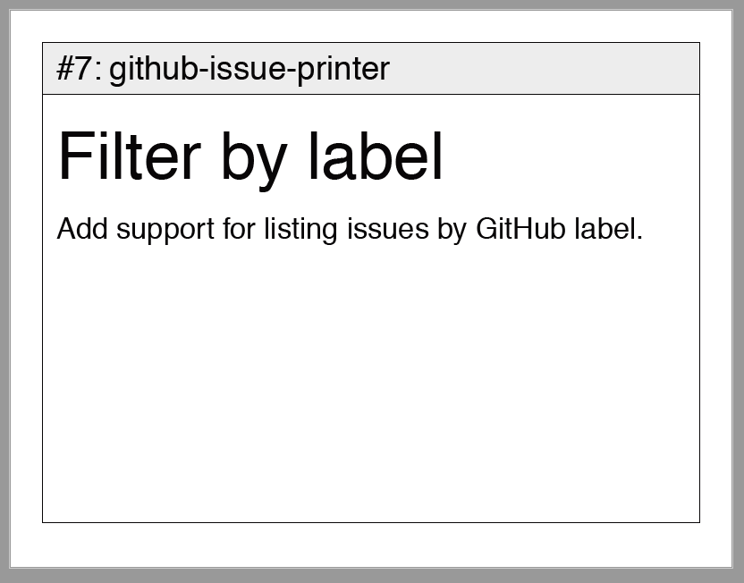

# github-issue-printer


## Description

This tool provides the ability to print a set of issues from a GitHub repo, in a format suitable for posting on a Kanban board. The tool queries GitHub and generates a PDF with one issue per page. It is suggested to use a PDF tool capable of reducing multiple pages to a single page (example 2x2) in order to print small cards (Adobe Reader for example).

The PDF will be written to `stdout` - capture stdout to save it.



## Usage: Input parameters

Usage of this tool requires a [GitHub personal API token](https://help.github.com/articles/creating-a-personal-access-token-for-the-command-line/) with `repo` scope. This value is supplied to the program via an environment variable named `GITHUB_API_TOKEN`.

### Environment variables

Input parameters can be configured via the following input parameters (instead of command line arguments):
- `GITHUB_API_TOKEN`
- `REPO_OWNER`
- `REPO_NAME`
- `REPO_MILESTONE`

### Command-line parameters

```console
$ node index.js --help

  Usage: index [options]

  Options:

    -V, --version                   output the version number
    -t, --token [github_api_token]  Your GitHub API token
    -o, --owner [repo_owner]        The GitHub repo owner - username or org name
    -r, --repo [repo_name]          The GitHub repo name
    -m, --milestone [number]        The repo milestone number (from the URL)
    -h, --help                      output usage information
```
**Note:** For security reasons, it is **highly recommended** to avoid passing the API token on the command line - use an environment variable instead~

## Execution

### Using Docker

You may run the program via Docker as follows:

```console
export GITHUB_API_TOKEN=xxxxxxxxxxxxx
docker run -e GITHUB_API_TOKEN -e REPO_OWNER=<OWNER> -e REPO_NAME=<REPO> -e REPO_MILESTONE=<NUM> jamiemjennings/github-issue-printer > output.pdf
```

For example:
```console
export GITHUB_API_TOKEN=xxxxxxxxxxxxx
docker run -e GITHUB_API_TOKEN -e REPO_OWNER=jamiemjennings -e REPO_NAME=github-issue-printer -e REPO_MILESTONE=1 jamiemjennings/github-issue-printer > ~/output.pdf
```

You may then open output.pdf with your preferred PDF reader to review/print.

### Using Node

```console
export GITHUB_API_TOKEN=xxxxxxxxxxxxx
npm install
node index.js --owner <OWNER> --repo <REPO> --milestone <NUM> > output.pdf
```

For example:
```console
export GITHUB_API_TOKEN=xxxxxxxxxxxxx
npm install
node index.js --owner jamiemjennings --repo github-issue-printer --milestone 1 > output.pdf
```